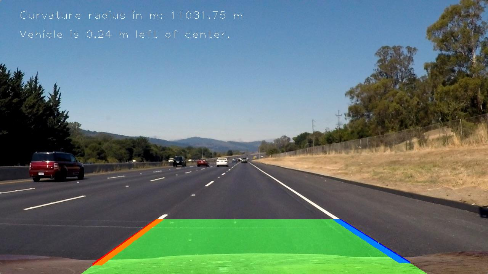

## Advanced Lane Finding

This project was done as an assignment for the Udacity course "Self-Driving Car Engineer Nanodegree". The purpose of this code is to detect lane lines on a video from an on-board camera of a car driving on a highway. Projecting the camera image to bird's eye view, we can compute the curvature of the lane by fitting a polynomial to the identified lane line pixels. We also compute the distance of the car from the middle of the lane.

<figure class"image">
	
</figure>

