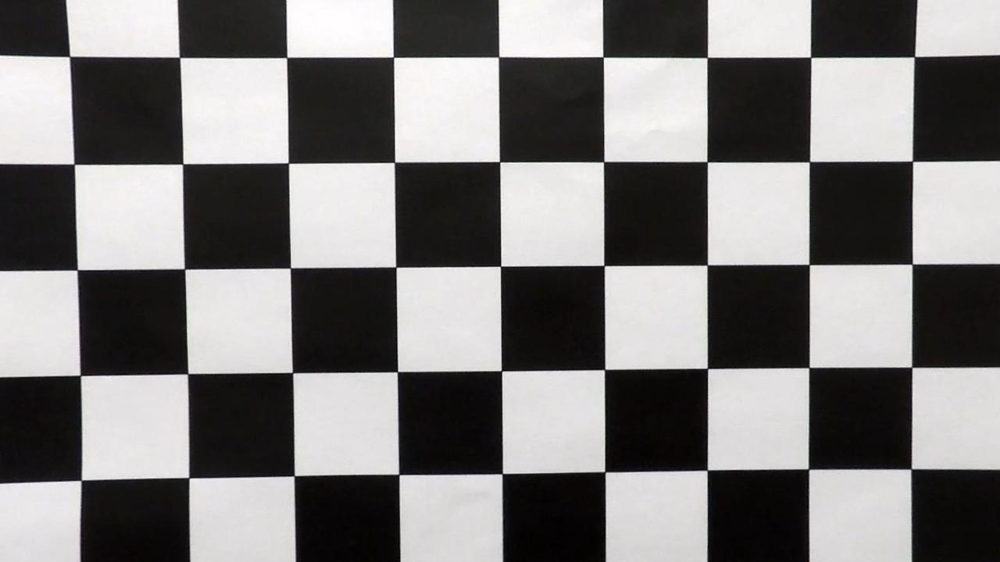
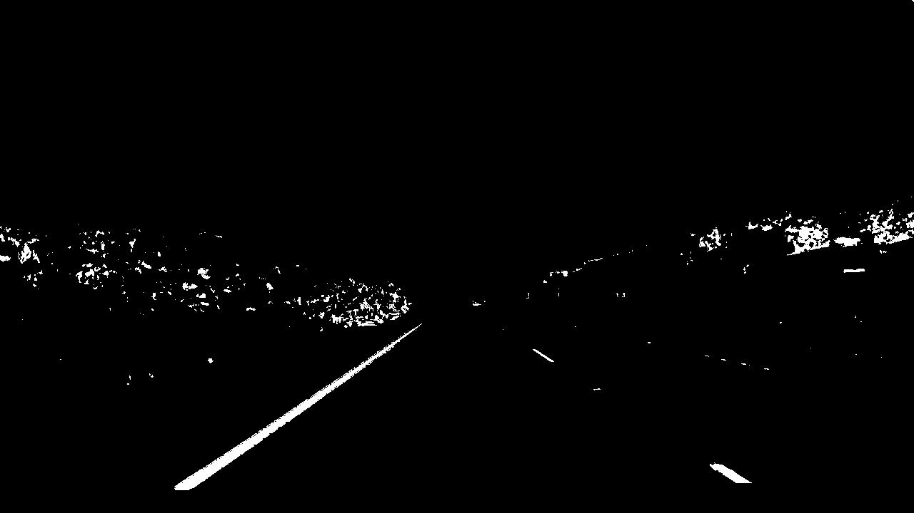

## Advanced Lane Finding
### The goal of this project is to identify and mark lane lines in  videos from an on-board camera of a car driving on a highway.

---

**Pipeline**

The steps of this project are the following:

* Compute the camera calibration matrix and distortion coefficients given a set of chessboard images.
* Apply a distortion correction to raw images.
* Use color transforms, gradients, etc., to create a thresholded binary image.
* Apply a perspective transform to rectify binary image ("birds-eye view").
* Detect lane pixels and fit to find the lane boundary.
* Determine the curvature of the lane and vehicle position with respect to center.
* Warp the detected lane boundaries back onto the original image.
* Output visual display of the lane boundaries and numerical estimation of lane curvature and vehicle position.

---

### Camera Calibration

I start by preparing "object points", which will be the (x, y, z) coordinates of the chessboard corners in the world. Here I am assuming the chessboard is fixed on the (x, y) plane at z=0, such that the object points are the same for each calibration image.  Thus, `objp` is just a replicated array of coordinates, and `objpoints` will be appended with a copy of it every time I successfully detect all chessboard corners in a test image.  `imgpoints` will be appended with the (x, y) pixel position of each of the corners in the image plane with each successful chessboard detection. To check if the detection of the corners on the chessboard was succesful, the corners can be drawn on a copy of the test images which are then stored in the output_images folder:


I then used the output `objpoints` and `imgpoints` to compute the camera matrix  and distortion coefficients using the `cv2.calibrateCamera()` function. 


### Undistort Images

Once we have found the camera matrix and the distortion coefficients we can undistort the images using the `cv2.undistort()` function:

<figure class="image">
	
	<figcaption>original image</figcaption>
</figure>

<figure class="image">
	
	<figcaption>undistorted image</figcaption>
</figure>

### HLS color transform

The function `hls_select()` takes an image, transforms it to HLS color space and then applies an upper and lower threshold to the s-channel (saturation channel) to generate a binary image. This will single out the lane lines since they have higher saturation values than other parts of the image.

<figure class="image">
	
	<figcaption> HLS threshold binary image </figcaption>
</figure>

### Gradient thresholds

A binary image can also be generated by calculating the gradient and applying thresholds:

1. The function `abs_sobel_threshold()`in the Gradient package takes the gradient in either the x- or y-direction and then applies lower and upper thresholds to its absolute value in order to generate a binary image.
2. The function `mag_threshold()`calculates the gradient in x- and y-direction and then applies lower and upper thresholds on the magnitude of the gradient.
3. The function `dir_threshold()`calculates the direction of the gradient and then applies lower and upper thresholds to it.

All three functions use the `cv2.Sobel()` method. The function `combine_gradient()` calls the functions `abs_sobel_threshold()` (for x and y gradients), `mag_threshold()` and `dir_threshold()` to calculate four binary images which are then combined to only one binary image using the logic:

`combined[((dir_binary == 1)&(mag_binary == 1))|((gradx==1) & (grady==1))] = 1`
i.e. a pixel gets value 1 if it has value 1 either on the gradient direction and gradient magnitude binary image or on the x-gradient and y-gradient binary image.

#### 3. Describe how (and identify where in your code) you performed a perspective transform and provide an example of a transformed image.

The code for my perspective transform includes a function called `warper()`, which appears in lines 1 through 8 in the file `example.py` (output_images/examples/example.py) (or, for example, in the 3rd code cell of the IPython notebook).  The `warper()` function takes as inputs an image (`img`), as well as source (`src`) and destination (`dst`) points.  I chose the hardcode the source and destination points in the following manner:

```python
src = np.float32(
    [[(img_size[0] / 2) - 55, img_size[1] / 2 + 100],
    [((img_size[0] / 6) - 10), img_size[1]],
    [(img_size[0] * 5 / 6) + 60, img_size[1]],
    [(img_size[0] / 2 + 55), img_size[1] / 2 + 100]])
dst = np.float32(
    [[(img_size[0] / 4), 0],
    [(img_size[0] / 4), img_size[1]],
    [(img_size[0] * 3 / 4), img_size[1]],
    [(img_size[0] * 3 / 4), 0]])
```

This resulted in the following source and destination points:

| Source        | Destination   | 
|:-------------:|:-------------:| 
| 585, 460      | 320, 0        | 
| 203, 720      | 320, 720      |
| 1127, 720     | 960, 720      |
| 695, 460      | 960, 0        |

I verified that my perspective transform was working as expected by drawing the `src` and `dst` points onto a test image and its warped counterpart to verify that the lines appear parallel in the warped image.

![alt text][image4]

#### 4. Describe how (and identify where in your code) you identified lane-line pixels and fit their positions with a polynomial?

Then I did some other stuff and fit my lane lines with a 2nd order polynomial kinda like this:

![alt text][image5]

#### 5. Describe how (and identify where in your code) you calculated the radius of curvature of the lane and the position of the vehicle with respect to center.

I did this in lines # through # in my code in `my_other_file.py`

#### 6. Provide an example image of your result plotted back down onto the road such that the lane area is identified clearly.

I implemented this step in lines # through # in my code in `yet_another_file.py` in the function `map_lane()`.  Here is an example of my result on a test image:

![alt text][image6]

---

### Pipeline (video)

#### 1. Provide a link to your final video output.  Your pipeline should perform reasonably well on the entire project video (wobbly lines are ok but no catastrophic failures that would cause the car to drive off the road!).

Here's a [link to my video result](./project_video.mp4)

---

### Discussion

#### 1. Briefly discuss any problems / issues you faced in your implementation of this project.  Where will your pipeline likely fail?  What could you do to make it more robust?

Here I'll talk about the approach I took, what techniques I used, what worked and why, where the pipeline might fail and how I might improve it if I were going to pursue this project further.  
