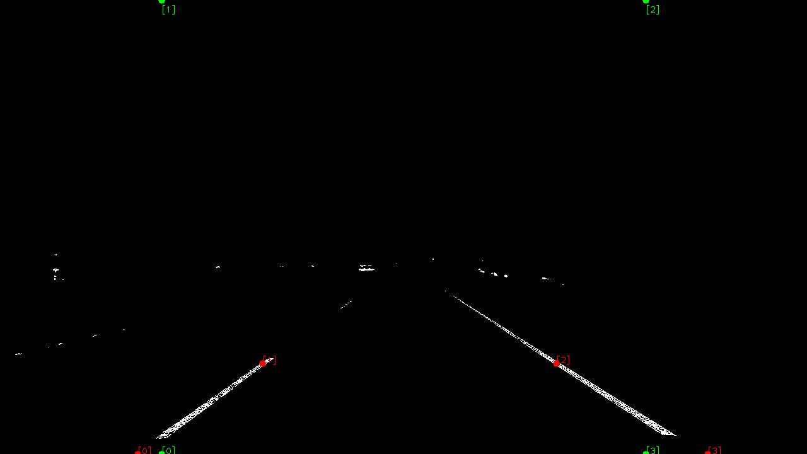
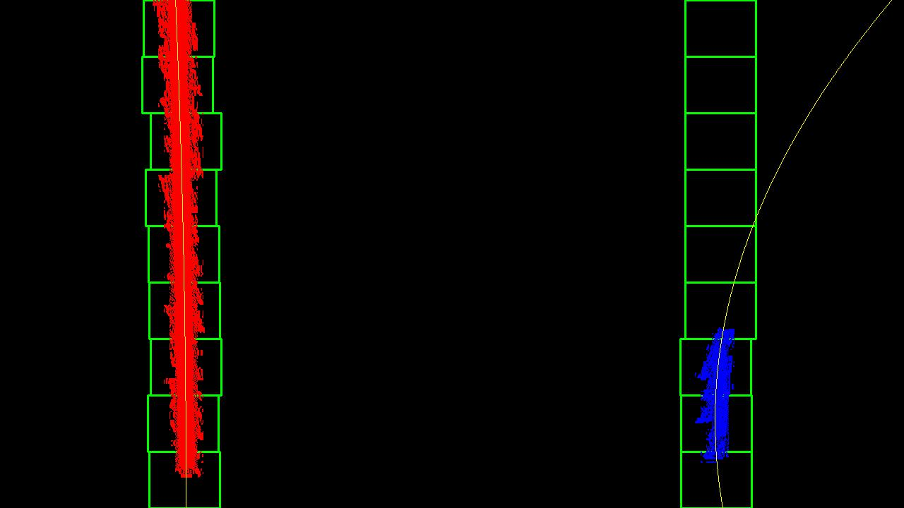

## Advanced Lane Finding
### The goal of this project is to identify and mark lane lines in  videos from an on-board camera of a car driving on a highway.

---

**Pipeline**

The steps of this project are the following:

* Compute the camera calibration matrix and distortion coefficients given a set of chessboard images.
* Apply a distortion correction to raw images.
* Use color transforms, gradients, etc., to create a thresholded binary image.
* Apply a perspective transform to rectify binary image ("birds-eye view").
* Detect lane pixels and fit to find the lane boundary.
* Determine the curvature of the lane and vehicle position with respect to center.
* Warp the detected lane boundaries back onto the original image.
* Output visual display of the lane boundaries and numerical estimation of lane curvature and vehicle position.

---

### Camera Calibration

Package: `camera_calibration`		
Function: `calibrate_camera`

I start by preparing "object points", which will be the (x, y, z) coordinates of the chessboard corners in the world. Here I am assuming the chessboard is fixed on the (x, y) plane at z=0, such that the object points are the same for each calibration image.  Thus, `objp` is just a replicated array of coordinates, and `objpoints` will be appended with a copy of it every time I successfully detect all chessboard corners in a test image.  `imgpoints` will be appended with the (x, y) pixel position of each of the corners in the image plane with each successful chessboard detection. To check if the detection of the corners on the chessboard was succesful, the corners can be drawn on a copy of the test images which are then stored in the output_images folder:

I then used the output `objpoints` and `imgpoints` to compute the camera matrix  and distortion coefficients using the `cv2.calibrateCamera()` function. 

### Undistort Images

Package: `undistort`		
Function `undistort_image`

Once we have found the camera matrix and the distortion coefficients we can undistort the images using the `cv2.undistort()` function:

<figure class="image">
	
	<figcaption>original image</figcaption>
</figure>

<figure class="image">
	
	<figcaption>undistorted image</figcaption>
</figure>

### Create a binary image
To create a binary image we use two distinct techniques:

1. We take the gradient of the pixel values in the image and apply a threshold on it.
2. We transform the image to the HLS color space and apply thresholds to the S- and L-channels.

#### Taking the gradient
Package: `gradient`		
Functions: `abs_sobel_threshold`, `mag_threshold`, `dir_threshold`, `combine_gradient`

1. The function `abs_sobel_threshold` takes the gradient in either the x- or y-direction and then applies lower and upper thresholds to its absolute value in order to generate a binary image.
2. The function `mag_threshold`calculates the gradient in x- and y-direction and then applies lower and upper thresholds on the magnitude of the gradient.
3. The function `dir_threshold`calculates the direction of the gradient and then applies lower and upper thresholds to it.

All three functions use the `cv2.Sobel()` method. The function `combine_gradient` calls the functions `abs_sobel_threshold` (for x and y gradients), `mag_threshold` and `dir_threshold` (for thresholds (pi/6, pi/3) (right lane) and (-pi/3, -pi/6) (left lane)) to calculate five binary images which are then combined to only one binary image using the logic:

	combined[(((dir_binary_pos == 1) | (dir_binary_neg == 1)) & (mag_binary == 1)) |
             ((gradx == 1) & (grady == 1))] = 1

<figure class="image">
	
	<figcaption>Example of an output image of the combine_gradient function.</figcaption>
</figure>

#### HLS transform and thresholding
Package: `hls_select`		
Function: `saturation_select`

The function `saturation_select` takes an image, transforms it to HLS color space and then applies an upper and lower threshold to the s-channel (saturation channel) to generate a binary image. A second threshold is then applied to the l-channel (lightness channel) in order to set pixels that are not bright enough to zero. This will single out the lane lines since they have higher saturation and lightness values than other parts of the image.

<figure class="image">
	
	<figcaption> HLS threshold binary image </figcaption>
</figure>

#### Combining gradient and HLS thresholding
Package: `binary_image`		
Function: `create_binary_image`

Finally, the function `create_binary_image` will combine the gradient and the HLS images (by using `cv2.bitwise_or`) to generate the final binary image.

### Perspective transform
Package: `perspective_transform`		
Functions: `do_perspective_transform`, `hough_lines_detection`, `lane_line_mask`, `find_points`, `warp_image`

In order to be able to detect the lane lines, fit a polynomial to them and calculate the curvature of the road, we must transform the image to bird's eye view. We do this in `do_perspective_transform` using the following steps:

1. We mask pixels that cannot be part of the lane line: Everything that is outside a trapezoid with corners (0.1 * xsize, ysize), (0.45 * xsize, 0.55 * ysize), (0.55 * xsize, 0.55 * ysize), (0.9 * xsize, ysize) and everything that is within a triangle with corners (0.33 * xsize, ysize), (0.5 * xsize, 0.4 * ysize), (0.66 * xsize, ysize) (`lane_line_mask`).
2. To find source points on the image we detect the lines on the masked image using the Hough algorithm (`hough_lines_detection`).
3. In `find_points` we take the longest detected line with negative slope (should be part of the left lane and the longest detected line with positive slope (should be part of the right lane), fit a line to it and then calculate the source points as follows:
	* Point 1: value of left line function at bottom of image
	* Point 2: value of left line function at 20% image size from the bottom
	* Point 3: value of right line function at 20% image size from the bottom of the 	image
	* Point 4: value of the right line function at the bottom of the image
	
	The destination points are defined as follows:
	
	* Point 1: bottom of image at 20% image width from the left border
	* Point 2: top of image at 20% image width from the left border
	* Point 3: top of image at 20% image width from the right border
	* Point 4: bottom of image at 20% image width from the right border
	
	Source (red) and destination (green) points can be seen in this image:
	<figure class"image">
		
		<figcaption>Source and destination points</figcaption>
	</figure>

4. Using the source and destination points do a perspective transform to bird's eye view of the masked image (`warp_image`).
	<figure class"image">
		
		<figcaption>Warped image</figcaption>
	</figure>

### Finding lane line pixels and fitting a polynomial
Package: `lane_poly_fit	`	
Functions: `find_starting_points`, `find_lane_pixels`, `search_around_poly`, `fit_polynomial`, `find_lanes`, `color_lane_pixels`

We can now identifiy the lane lines and fit a 2nd order polynomial to them (`find_lane_lines`):

1. We must first identify points on the bottom of the image where to start our search for lane line pixels. To do so we calculate the histogram of the binary image along the x-axis and then take the x-values of the points where this histogram has a maximum on the left and on the right half of the image. This corresponds to the approximate position of the lane lines (`find_starting_points`).
2. We than search for non-zero pixels in a small window around the starting point. When we have found enough of those pixels, we shift the window upwards, centering it on the x-value corresponding to the maximum of the histogram previous histogram (`find_lane_pixels`). If we have already fitted a polynomial before (i.e. in the previous frame of the video), we can use this polynomial to center the windows (`search_around_poly`).
3. In both cases, we fit a 2nd order polynomial to the detected points (`fit_polynomial`).
	<figure class"image">
		
		<figcaption>Detecting lane lines using sliding windows and fitting a 		polynomial</figcaption>
	</figure>
As you can see, the fit is not very good for short lane lines. We thus also return two variables `l_left_seg` and `l_right_seg` that indicate which lane line segment is longer. For calculating the gradient, we will take into account only the polynomial fit to the longer segment. If `fit_polynomial` fails to fit a polynomial, we re-use the one from the previous frame.

The function `color_lane_pixels` returns an image with the detected pixels on the left line colored red, the detected pixels on the right line colored blue and all other pixel values set to zero. Using `warp_image` with source and destination points  interchanged, we can project these pixels on the perspective of the input image.

#### 5. Describe how (and identify where in your code) you calculated the radius of curvature of the lane and the position of the vehicle with respect to center.

I did this in lines # through # in my code in `my_other_file.py`

#### 6. Provide an example image of your result plotted back down onto the road such that the lane area is identified clearly.

I implemented this step in lines # through # in my code in `yet_another_file.py` in the function `map_lane()`.  Here is an example of my result on a test image:

![alt text][image6]

---

Here's a [link to my video result](./project_video.mp4)

---

